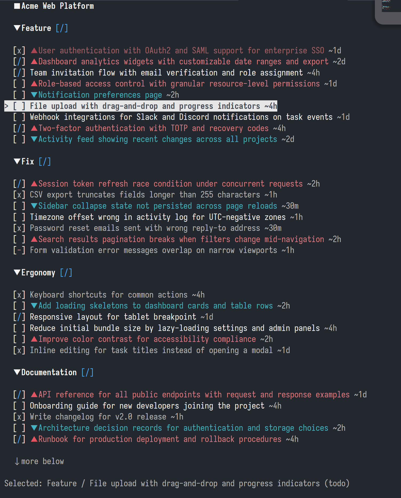

# Phasionary

A terminal-first, keyboard-driven project planning tool. Local-only, offline by default.



## Features

- **Keyboard-driven** - Vim-style navigation and commands
- **Local-first** - All data stored locally as JSON files
- **Offline by default** - No network dependency
- **SSH-friendly** - Works over SSH and low-bandwidth terminals
- **Single binary** - No dependencies to install

## Installation

### From source

```bash
git clone https://github.com/ilyasturki/phasionary.git
cd phasionary
go build -o phasionary ./cmd/phasionary
```

### NixOS

Try it without installing:

```bash
nix run github:ilyasturki/phasionary
```

To add to your NixOS configuration, add the flake input:

```nix
# flake.nix
{
  inputs.phasionary.url = "github:ilyasturki/phasionary";
}
```

Then add the package (pass `inputs` via `specialArgs`):

```nix
# configuration.nix or home-manager
{ inputs, ... }:
{
  environment.systemPackages = [
    inputs.phasionary.packages.x86_64-linux.default
  ];
}
```

## Usage

```bash
phasionary              # Open last project or project picker
phasionary -p "myproj"  # Open specific project by name
```

## Keybindings

### Navigation

| Key | Action |
|-----|--------|
| `j` / `↓` | Move down |
| `k` / `↑` | Move up |
| `gg` | Jump to top |
| `G` | Jump to bottom |
| `Ctrl+d` | Half page down |
| `Ctrl+u` | Half page up |
| `Ctrl+f` | Page down |
| `Ctrl+b` | Page up |
| `zz` | Center on selection |

### Actions

| Key | Action |
|-----|--------|
| `Enter` | Edit selected item |
| `Space` | Toggle task status |
| `a` | Add new task |
| `A` | Add new category |
| `d` | Delete selected |
| `y` | Copy to clipboard |
| `x` | Cut task |
| `p` | Paste task |
| `e` | Edit in external editor |
| `h` / `l` | Decrease / Increase priority |
| `J` / `K` | Move item down / up |
| `s` / `S` | Sort tasks by status |
| `t` | Set time estimate |

### Views

| Key | Action |
|-----|--------|
| `?` | Toggle help |
| `P` | Open project picker |
| `o` | Open options |
| `f` | Filter tasks |
| `i` | View item info |
| `q` | Quit |

## Data Storage

Projects are stored as JSON files in `~/.local/share/phasionary/projects/`.

Configuration is stored in `~/.config/phasionary/config.json`.

## License

MIT
