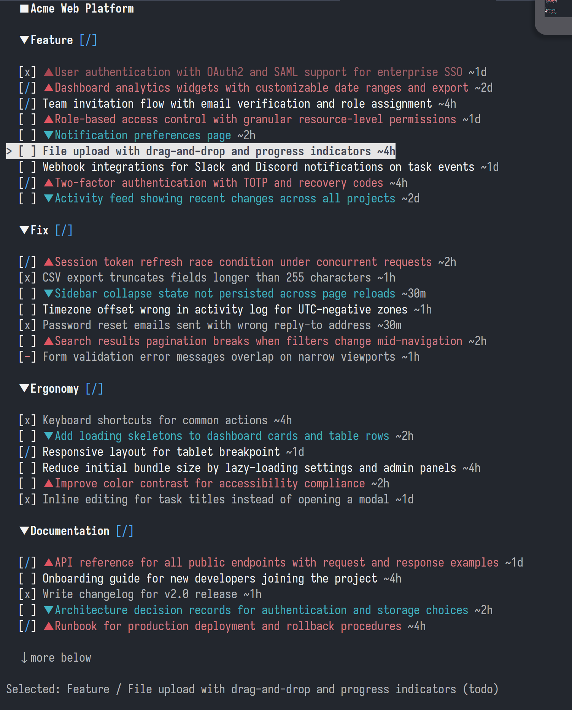

# Phasionary

A terminal-first, keyboard-driven project planning tool. Local-only, offline by default, single binary.



## Features

- **Vim-style TUI** — Navigate, edit, and manage tasks without leaving the keyboard. Supports motions like `gg`, `G`, `Ctrl+d/u`, fold toggles (`za`, `zc`, `zo`), and category jumps (`{`/`}`)
- **Full CLI** — Every action available from the command line with structured JSON output (`-j`) for scripting
- **Multiple projects** — Create and switch between projects, each stored as its own JSON file
- **Categories** — Organize tasks under user-defined categories (defaults: Feature, Fix, Ergonomy, Documentation, Research)
- **Filtering** — Filter the task list by status to focus on what matters
- **Import / Export** — Import and export projects as Markdown or JSON
- **Clipboard operations** — Copy task titles (`y`) or entire categories as Markdown (`Y`)
- **External editor** — Press `e` to edit task details in your `$EDITOR`
- **Shell completions** — Tab completion for Bash, Zsh, and Fish
- **SSH-friendly** — Works over SSH and low-bandwidth terminals
- **Single binary** — No runtime dependencies, no network access, no accounts

## Installation

### From source

```bash
git clone https://github.com/ilyasturki/phasionary.git
cd phasionary
go build -o phasionary ./cmd/phasionary
```

### NixOS

Try it without installing:

```bash
nix run github:ilyasturki/phasionary
```

To add to your NixOS configuration, add the flake input:

```nix
# flake.nix
{
  inputs.phasionary.url = "github:ilyasturki/phasionary";
}
```

Then add the package (pass `inputs` via `specialArgs`):

```nix
# configuration.nix or home-manager
{ inputs, ... }:
{
  environment.systemPackages = [
    inputs.phasionary.packages.x86_64-linux.default
  ];
}
```

## Quick Start

```bash
phasionary                # Launch TUI — opens last project or the project picker
phasionary -p "myproj"    # Open a specific project by name
```

On first run, Phasionary creates a default project with starter categories. Use `a` to add tasks, `Space` to toggle status, and `?` to see all keybindings.

## TUI Keybindings

### Navigation

| Key | Action |
|-----|--------|
| `j` / `↓` | Move down |
| `k` / `↑` | Move up |
| `gg` | Jump to top |
| `G` | Jump to bottom |
| `{` | Jump to previous category |
| `}` | Jump to next category |
| `Ctrl+d` | Half page down |
| `Ctrl+u` | Half page up |
| `Ctrl+f` | Page down |
| `Ctrl+b` | Page up |
| `zz` | Center on selection |
| `Tab` / `za` | Fold/unfold category |
| `zc` | Fold all categories |
| `zo` | Unfold all categories |

### Actions

| Key | Action |
|-----|--------|
| `Enter` | Edit selected item |
| `Space` | Toggle task status |
| `a` | Add new task |
| `A` | Add new category |
| `d` | Delete selected |
| `y` | Copy title to clipboard |
| `Y` | Copy category as Markdown |
| `x` | Cut task |
| `p` | Paste task |
| `e` | Edit in external editor |
| `h` / `l` | Decrease / Increase priority |
| `J` / `K` | Move item down / up |
| `s` / `S` | Sort tasks by status |
| `t` | Set time estimate |

### Views

| Key | Action |
|-----|--------|
| `?` | Toggle help |
| `P` | Open project picker |
| `o` | Open options |
| `f` | Filter tasks by status |
| `i` | View item info |
| `q` | Quit |

## CLI

All commands support `-j` for JSON output and `-q` for quiet mode.

### Projects

```bash
phasionary projects                     # List all projects (alias: ps)
phasionary project show [name-or-id]    # Show project details (alias: p)
phasionary project add "My Project"     # Create a new project (alias: pa)
phasionary project edit -n "New Name"   # Rename a project (alias: pe)
phasionary project delete               # Delete a project (alias: pd)
phasionary project use "My Project"     # Set default project (alias: pu)
```

### Tasks

```bash
phasionary tasks                                  # List all tasks (alias: ts)
phasionary tasks -s todo -C "Feature"             # Filter by status and category
phasionary task show <id-or-title>                # Show task details (alias: t)
phasionary task add -C "Feature" "Build widget"   # Add task to category (alias: ta)
phasionary task edit <id> -t "New title"          # Edit task properties (alias: te)
phasionary task status <id> in_progress           # Update status (alias: tst)
phasionary task priority <id> high                # Update priority (alias: tp)
phasionary task move <id> "Fix"                   # Move task to another category (alias: tm)
phasionary task delete <id>                       # Delete task (alias: td)
```

### Categories

```bash
phasionary categories                           # List all categories (alias: cs)
phasionary category show "Feature"              # Show category details (alias: c)
phasionary category add "Refactor"              # Add a category (alias: ca)
phasionary category edit "Fix" -n "Bugfix"      # Rename a category (alias: ce)
phasionary category delete "Refactor"           # Delete a category (alias: cd)
```

### Import / Export

```bash
phasionary export                          # Export as Markdown to stdout
phasionary export -f json -o project.json  # Export as JSON to file
phasionary import project.md               # Import from Markdown
phasionary import data.json -n "Imported"  # Import JSON with custom name
```

### Configuration

```bash
phasionary config                            # Show current configuration
phasionary config path                       # Show config file path
phasionary config set status_display icons   # Use icons instead of text labels
phasionary config set default_project <id>   # Set the default project
```

### Shell Completions

```bash
phasionary completion bash   # Generate Bash completions
phasionary completion zsh    # Generate Zsh completions
phasionary completion fish   # Generate Fish completions
```

## Configuration

Config file location: `~/.config/phasionary/config.json`

| Key | Values | Default | Description |
|-----|--------|---------|-------------|
| `status_display` | `text`, `icons` | `text` | How task status is rendered in the TUI |
| `default_project` | project UUID | (none) | Project to open on launch |

Override paths with environment variables:

| Variable | Description |
|----------|-------------|
| `PHASIONARY_CONFIG_PATH` | Custom config file path |
| `PHASIONARY_DATA_PATH` | Custom data directory path |

## Data Storage

Projects are stored as individual JSON files in `~/.local/share/phasionary/projects/`, one file per project (`{uuid}.json`). UI state (fold state, last project per directory) is tracked separately in `~/.local/share/phasionary/state.json`.

Every change is saved synchronously — there is no undo, but your data is always on disk.

## License

[MIT](LICENSE)
